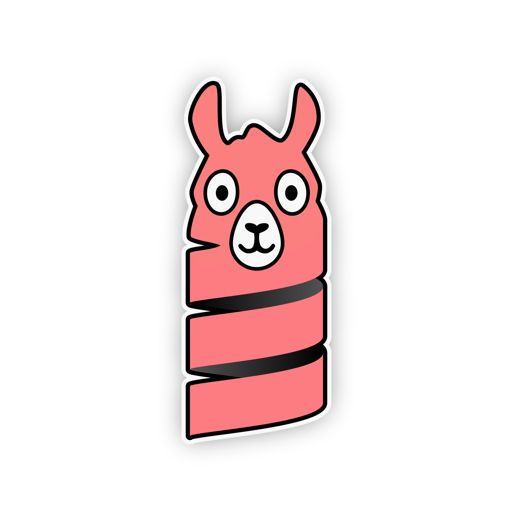

## llm4s

[](https://central.sonatype.com/artifact/com.donderom/llm4s_3)
[](https://javadoc.io/doc/com.donderom/llm4s_3/latest/index.html)
[](https://github.com/donderom/llm4s/actions/workflows/ci.yml)
[](https://github.com/donderom/llm4s/blob/main/LICENSE)

<p align="center">

</p>

*Experimental* Scala 3 bindings for [llama.cpp](https://github.com/ggml-org/llama.cpp) using [Slinc](https://github.com/scala-interop/slinc).

### Setup

Add `llm4s` to your `build.sbt`:

```scala
libraryDependencies += "com.donderom" %% "llm4s" % "0.22.0-b10273"
```

For JDK 17 add `.jvmopts` file in the project root:

```
--add-modules=jdk.incubator.foreign
--enable-native-access=ALL-UNNAMED
```

#### Compatibility

* Scala: 3.3.0
* JDK: 17 or 19
* `llama.cpp`: The version suffix refers to the latest supported `llama.cpp` release (e.g. version `0.22.0-b10273` means that it supports the [b10273](https://github.com/ggml-org/llama.cpp/releases/tag/b10273) release). The newer releases are usually supported as well, provided there are no API changes.

<details>
  <summary>Older versions</summary>

  | llm4s |     Scala |    JDK | llama.cpp (commit hash) |
  |------:|----------:|-------:|------------------------:|
  | 0.11+ |     3.3.0 | 17, 19 |   229ffff (May 8, 2024) |
  | 0.10+ |     3.3.0 | 17, 19 |  49e7cb5 (Jul 31, 2023) |
  |  0.6+ | 3.3.0-RC3 |    --- |  49e7cb5 (Jul 31, 2023) |
  |  0.4+ | 3.3.0-RC3 |    --- |  70d26ac (Jul 23, 2023) |
  |  0.3+ | 3.3.0-RC3 |    --- |  a6803ca (Jul 14, 2023) |
  |  0.1+ | 3.3.0-RC3 | 17, 19 |  447ccbe (Jun 25, 2023) |

</details>

### Usage

```scala
import java.nio.file.Paths
import com.donderom.llm4s.*

// Path to the llama.cpp shared library
System.load("./build/bin/libllama.dylib")

// Path to the model supported by llama.cpp
val model = Paths.get("Llama-3.2-3B-Instruct-Q6_K.gguf")
val prompt = "What is LLM?"
```

#### Completion

```scala
val llm = Llm(model)

// To print generation as it goes
llm(prompt).foreach: stream =>
  stream.foreach: token =>
    print(token)

// Or build a string
llm(prompt).foreach(stream => println(stream.mkString))

llm.close()
```

#### Embeddings

```scala
val llm = Llm(model)
llm.embeddings(prompt).foreach: embeddings =>
  embeddings.foreach: embd =>
    print(embd)
    print(' ')
llm.close()
```

### Self-contained [Scala CLI](https://scala-cli.virtuslab.org) examples

#### Basic [Llama 3](https://huggingface.co/bartowski/Llama-3.2-3B-Instruct-GGUF) model

`Run.scala`:
```scala
//> using scala 3.3.0
//> using jvm adoptium:17
//> using java-opt --add-modules=jdk.incubator.foreign
//> using java-opt --enable-native-access=ALL-UNNAMED
//> using dep com.donderom::llm4s:0.22.0-b10273

import com.donderom.llm4s.Llm
import java.nio.file.Paths
import scala.util.Using

object Main extends App:
  System.load("./build/bin/libllama.dylib")
  // Path to the downloaded model (models are not downloaded automatically)
  val model = Paths.get("Llama-3.2-3B-Instruct-Q6_K.gguf")
  val prompt = "What is LLM?"
  Using(Llm(model)): llm =>         // llm : com.donderom.llm4s.Llm
    llm(prompt).foreach: stream =>  // stream : LazyList[String]
      stream.foreach: token =>      // token : String
        print(token)
```

```sh
scala-cli Run.scala
```

#### Configured [gpt-oss](https://huggingface.co/ggml-org/gpt-oss-20b-GGUF) model

`Run.scala`:
```scala
//> using scala 3.3.0
//> using jvm adoptium:17
//> using java-opt --add-modules=jdk.incubator.foreign
//> using java-opt --enable-native-access=ALL-UNNAMED
//> using dep com.donderom::llm4s:0.22.0-b10273

import com.donderom.llm4s.{ContextParams, FlashAttention, Llm, LlmParams}
import java.nio.file.Paths
import scala.util.Using

object Main extends App:
  System.load("./build/bin/libllama.dylib")
  // Path to the downloaded model (models are not downloaded automatically)
  val model = Paths.get("gpt-oss-20b-mxfp4.gguf")
  val prompt = "What is LLM?"
  // Use Flash attention and context size provided by the model
  val params = LlmParams(context = ContextParams(flashAttention = FlashAttention.On))
  Using(Llm(model)): llm =>                 // llm : com.donderom.llm4s.Llm
    llm(prompt, params).foreach: stream =>  // stream : LazyList[String]
      stream.foreach: token =>              // token : String
        print(token)
```

```sh
scala-cli Run.scala
```

#### Configured [Qwen3.8](https://huggingface.co/unsloth/Qwen3.8-27B-GGUF) model using recommended settings

`Run.scala`:
```scala
//> using scala 3.3.0
//> using jvm adoptium:17
//> using java-opt --add-modules=jdk.incubator.foreign
//> using java-opt --enable-native-access=ALL-UNNAMED
//> using dep com.donderom::llm4s:0.22.0-b10273

import com.donderom.llm4s.{ContextParams, FlashAttention, Llm, LlmParams, Sampling}
import java.nio.file.Paths
import scala.util.Using

object Main extends App:
  System.load("./build/bin/libllama.dylib")
  // Path to the downloaded model (models are not downloaded automatically)
  val model = Paths.get("Qwen3.8-27B-Q4_1.gguf")
  val prompt = "What is LLM?"
  // Use Flash attention and sampling parameters for instruct mode
  val params = LlmParams(
    context = ContextParams(flashAttention = FlashAttention.On),
    sampling = Sampling.Dist(temp = 0.7, topK = Some(20), minP = None)
  )
  Using(Llm(model)): llm =>                 // llm : com.donderom.llm4s.Llm
    llm(prompt, params).foreach: stream =>  // stream : LazyList[String]
      stream.foreach: token =>              // token : String
        print(token)
```

```sh
scala-cli Run.scala
```

### Configuration

Apart from the model path, the examples above differ in what configuration params passed to the model.

There are three entry points for configuring the model:

* [ModelParams](https://javadoc.io/static/com.donderom/llm4s_3/0.22.1-b10273/com/donderom/llm4s/ModelParams.html) are passed once when an [Llm](https://javadoc.io/static/com.donderom/llm4s_3/0.22.1-b10273/com/donderom/llm4s/Llm$.html#apply-fffffa5f) is instantiated
* [LlmParams](https://javadoc.io/static/com.donderom/llm4s_3/0.22.1-b10273/com/donderom/llm4s/LlmParams.html) containing most of parameters which are optionally passed to every [generation](https://javadoc.io/static/com.donderom/llm4s_3/0.22.1-b10273/com/donderom/llm4s/Llm.html#generate-b08) along with the prompt
* [EmbeddingParams](https://javadoc.io/static/com.donderom/llm4s_3/0.22.1-b10273/com/donderom/llm4s/EmbeddingParams.html) are used for generating [embeddings](https://javadoc.io/static/com.donderom/llm4s_3/0.22.1-b10273/com/donderom/llm4s/Llm.html#embeddings-9de)
